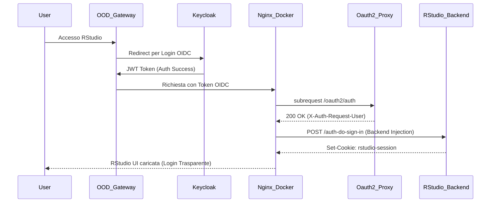

# OOD, Keycloak, & Step-CA Integration Guide

Questa guida descrive l'architettura Sysadmin raccomandata per l'integrazione del cluster RStudio (versione Docker/Kubernetes) con un Identity Provider istituzionale (es. **Keycloak**) governato tramite **Open OnDemand (OOD)**.

## 1. Architettura Sysadmin (Backend Auth Injection)

Storicamente, il deployment on-premise si basava su un'autenticazione PAM/AD diretta sui nodi. Nel nuovo modello *Cloud Native*:

1. **OOD come PEP (Policy Enforcement Point)**: Il master node di OOD agirà da gateway principale pubblico, effettuando l'handshake OIDC (OAuth2) con Keycloak.
2. **Oauth2-Proxy (Sidecar)**: Il nodo Docker (RStudio) non esporrà PAM su internet. L'Accesso avverrà unicamente tramite un container sidecar `oauth2-proxy` che valida i token JWT provenienti dall'infrastruttura OOD.
3. **Il Limite di RStudio OOS**: RStudio Open Source *non* accetta l'header `X-Forwarded-User` nativamente (feature commerciale Posit Workbench). Usare Javascript per "nascondere" un login PAM (Logica Ottimistica) è considerato insicuro e non-standard in questo scenario.
4. **La Soluzione: Backend Proxy Injection**: Nginx intercetterà l'utente autorizzato dal sidecar OIDC, si autenticherà internamente sul modulo PAM di backend (o tramite script Lua dedicato) e scambierà il token OIDC con una sessione RStudio valida (`csrf-token`). Zero interazione richiesta all'utente.

### Flusso Dati (OIDC)



## 2. Abilitazione in docker-compose.yml

Nel file `docker-compose.yml` è presente un profilo disattivato di default chiamato `oidc`:

```yaml
  # --- OAuth2-Proxy Sidecar (OIDC Authentication) ---
  oauth2-proxy:
    profiles: [ "oidc" ]
    image: quay.io/oauth2-proxy/oauth2-proxy:v7.6.0
# ...
```

**Per avviare in modalità OIDC**:
Assicurarsi di creare un file `config/oauth2-proxy.cfg` con i secret di Keycloak e lanciare il compose includendo il profilo:

```bash
docker compose --profile oidc up -d
```

## 3. Gestione Nginx Blueprint

I template di Nginx (`templates/nginx_proxy_location.conf.template`) includono già dei **Blueprint commentati**. Per completare la migrazione:

1. **Commentare** le sezioni denominate `--- AD PAM AUTHENTICATION ---`
2. **De-commentare** le sezioni `--- OIDC / OAUTH2-PROXY BLUEPRINT ---` (sostituendo le chiamate `auth_pam` con `auth_request /oauth2/auth;`).
3. **Fine-tuning dell'Injection**: L'ultimo step (Injection Proxy verso RStudio) richiede generalmente l'aggiunta di un blocco `proxy_set_header` dinamico in base all'architettura specifica dell'infrastruttura PAM residua nel filesystem del container RStudio.

## 4. Trust Chain Step-CA interni

Poiché lo scambio di token OIDC avverrà su reti interne (Intranet/VPN Datacenter), la validazione dei certificati SSL è fondamentale.

Nel `.env` e nel `docker-compose.yml` è previsto il mount della Root CA interna:

- `STEP_CA_ROOT_PATH=/etc/ssl/certs/step-ca-root.crt`

Il processo S6 durante l'entrypoint (`scripts/entrypoint_rstudio.sh`) rileverà automaticamente questo mount e invocherà `update-ca-certificates`, permettendo a RStudio (e ai pacchetti R come `httr` e `curl`) di completare chain di fiducia TLS verso l'API Nextcloud su server TrueNAS remoti, evitando l'errore `SSL certificate problem: unable to get local issuer certificate`.
