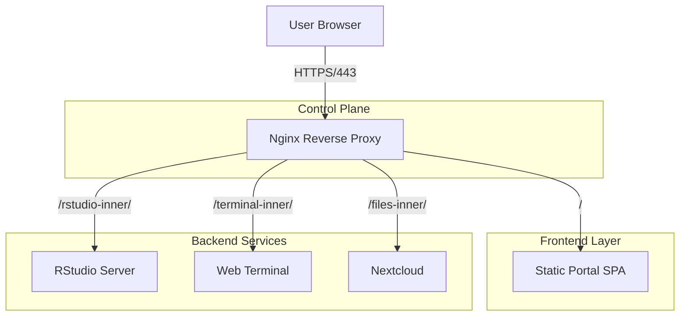

# System Architecture Overview

## 1. Introduction

The **Botanical Big Data Calculus Portal** is a centralized access point for research computing services. It provides a unified, Single-Sign-On (SSO) experience for:

- **RStudio Server**: Statistical computing environment.
- **Web Terminal**: Direct shell access via `ttyd`.
- **Nextcloud**: Research data management.

The system is designed to be **lightweight**, **serverless** (frontend), and **robust**, leveraging Nginx as the intelligent core.

## 2. High-Level Architecture

The solution uses a **"Static Frontend + Intelligent Proxy"** pattern.

### 2.1 Core Components

#### A. Nginx (The Gatekeeper)

Nginx is the critical infrastructure piece. It is not just a proxy; it is the **Auth Enforcement Point**.

- **SSL Termination**: Handles all encryption.
- **Authentication**: Uses `auth_pam` to validate credentials against the system (AD/LDAP via PAM).
- **path Rewriting**: Maps user-friendly URLs to backend service paths.
- **Header Manipulation**: Spoofs `Origin`, `Referer`, and injects `X-Forwarded-User` to "trick" backends into trusting the request.

#### B. The Portal (The Driver)

The Portal is a static HTML/JS application served by Nginx.

- **Role**: Credential Manager.
- **Function**: It does not authenticate users itself (Nginx does that). Instead, it **automates** the login process for other services.
- **Mechanism**: It accepts credentials via a modal, verifies them against Nginx, and then "seeds" the session for RStudio and Nextcloud before opening them.

## 3. Design Philosophy

1. **Zero-Backend Frontend**:
    - We avoid complex middleware (Node.js, Flask, Django). The Portal is just HTML/JS.
    - **Benefit**: Extremely low maintenance, easy to deploy, zero attack surface on the frontend code itself.

2. **Context Isolation (New Tab Strategy)**:
    - Services open in `target="_blank"`.
    - **Benefit**: This isolates the heavy services (RStudio/Nextcloud) from the lightweight Portal. If RStudio crashes, the Portal stays open.
    - **Security**: Prevents Cross-Origin issues and allows usage of strict Cookies that browsers block in iframes.

3. **Standardized Auth Headers**:
    - We standardize on `X-Forwarded-User` for identity propagation where possible (Terminal), and standard Session Cookies where not (RStudio, Nextcloud).

## 4. Key Decisions & Trade-offs

| Decision | Rationale | Trade-off |
| :--- | :--- | :--- |
| **URL Injection for Terminal** | Only way to pass Basic Auth credentials to `ttyd`. | Requires aggressive JS sanitization to hide password. |
| **Client-Seeded CSRF** | RStudio requires CSRF token in body & cookie. JS generation allows this without backend code. | Requires `crypto.randomUUID` (modern browser) for sufficient entropy. |
| **Static HTML Templates** | Simple deployment via `sed` substitution. | Less dynamic than a true rendering engine, but sufficient for this scale. |

---

## 5. Future Roadmap

### Phase 1: OIDC / OAuth2 Implementation

Transition from Basic Auth to Keycloak/Authentik. This would allow the Portal to delegate authentication entirely, removing the need to handle passwords in JS.

### Phase 2: Containerization

Move services to Docker/Kubernetes (JupyterHub style) to provide per-user resource isolation.
